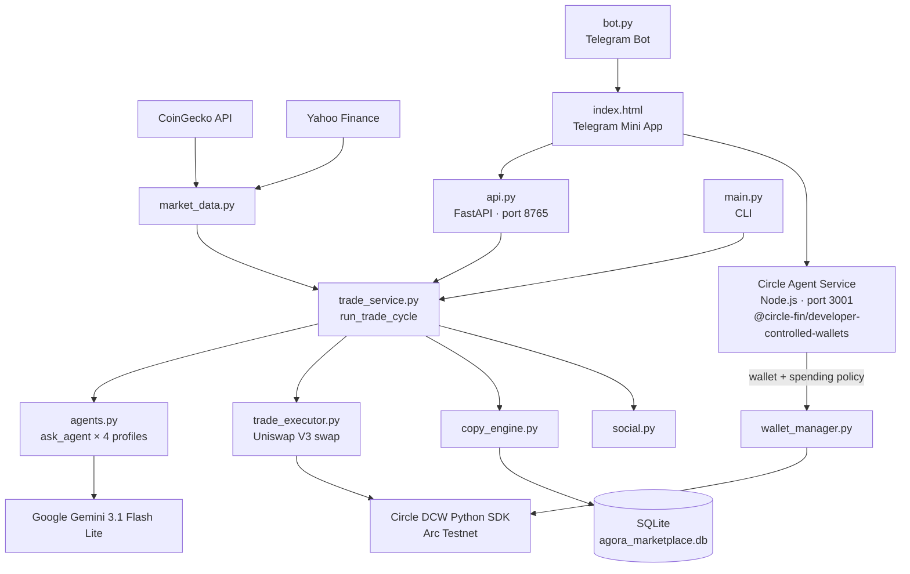

# Arc_Tic Whale

**Arc_Tic Whale** is an AI-driven copy-trading app on **Arc Testnet**. Four Google Gemini-powered investing agents analyze live markets, execute swaps via Uniswap V3, and let users mirror agent strategies automatically — with every user wallet protected by **Circle Agent Stack spending policies**.

---

## ⭐ Circle Agent Stack Integration

> This project integrates [Circle Agent Stack](https://agents.circle.com) — Circle's financial infrastructure for the agentic economy (launched May 2026).

### What Circle Agent Stack adds to this project

A dedicated **Node.js microservice** (`agent_service/`) sits alongside the Python backend. Every time a user wallet is created, it goes through the Agent Service, which attaches **spending policy guardrails** via the Circle Agent Stack SDK before the wallet is handed back to the user.

```
User signs up
      │
      ▼
Python FastAPI  ──httpx──►  Circle Agent Service (Node.js · port 3001)
                                    │
                                    │  @circle-fin/developer-controlled-wallets
                                    ▼
                             Circle API → Arc Testnet wallet created
                                    │
                                    ▼
                          Spending policy attached:
                          • Max $2.00 per transaction
                          • Max $50.00 per day
                          • Max $500.00 per month
```

### Circle Agent Stack SDK used

**Package:** `@circle-fin/developer-controlled-wallets@^10.3.1` (JS/TypeScript SDK)

**File:** [`agent_service/index.js`](agent_service/index.js)

| SDK call | What it does |
|---|---|
| `initiateDeveloperControlledWalletsClient()` | Authenticates with Circle using `CIRCLE_API_KEY` + `CIRCLE_ENTITY_SECRET` |
| `client.createWalletSet()` | Creates a named wallet set for the user |
| `client.createWallets()` | Provisions an SCA (Smart Contract Account) wallet on Arc Testnet |
| `client.updateWallet({ spendingLimits })` | **Attaches spending policy** — per-tx, daily, and monthly USDC caps |
| `client.getWallet()` | Retrieves wallet info |
| `client.listWalletBalance()` | Queries USDC balance for a wallet |

### Agent Service REST API

The Agent Service exposes these endpoints (port 3001):

| Method | Path | Description |
|---|---|---|
| `GET` | `/health` | Returns Circle configuration status + dry-run mode |
| `POST` | `/wallets` | Create wallet + attach spending policy |
| `GET` | `/wallets/:id` | Get wallet state and address |
| `GET` | `/wallets/:id/balance` | Get token balances |
| `PUT` | `/wallets/:id/policy` | Update spending limits on an existing wallet |

### Spending policy shape

```js
// Attached to every new user wallet at creation time
spendingLimits: [
  { limits: [{ amount: "10.00", currency: "USD" }], timeFrame: "TRANSACTION" },
  { limits: [{ amount: "200.00", currency: "USD" }], timeFrame: "DAILY" },
  { limits: [{ amount: "1000.00", currency: "USD" }], timeFrame: "MONTHLY" },
]
```

### Fallback safety

If the Agent Service is unreachable, the Python backend automatically falls back to the existing Circle Developer Controlled Wallets Python SDK — **no user-facing errors, no downtime**.

---

## AI Agent Variations

One `GOOGLE_API_KEY` powers all four agent profiles. Each uses the same Gemini 3.1 Flash Lite model with a different system prompt, risk posture, and temperature — producing genuinely different investing decisions:

| Agent ID | Display Name | Risk | Temp | Strategy |
|---|---|---|---|---|
| `Conservative_Whale` | Arc_Tic Whale 🐋 | Low | 0.2 | Patient blue-chip accumulator, buys confirmed dips only |
| `Macro_Economist` | Macro Economist 📈 | Medium | 0.35 | Fed-watching swing trader, reacts to macro news |
| `Aggressive_Degen` | Aggressive Degen ⚡ | High | 0.55 | Momentum breakout trader, accepts higher drawdown |
| `Yield_Farmer` | Yield Farmer 🌊 | Low | 0.25 | Stablecoin-first, rotates into majors only on strong setups |

All four agents are live in the marketplace. Users can follow any agent — each gets its own metrics, follower count, and feed entries attributed correctly.

---

## Architecture



### Data Flow

```
Market Data (CoinGecko / Yahoo Finance)
       │
       ▼
  AI Agent (Gemini 3.1 Flash Lite · one of 4 profiles)
  ──► DECISION: BUY / SELL / HOLD + asset + reason
       │
       ▼
  Trade Executor (Circle Wallet → Uniswap V3 → Arc Testnet)
       │
       ├──► Copy Engine  (mirror trade to all follower wallets)
       └──► Social Feed  (live feed entry attributed to correct agent)

  On user wallet creation:
  Python ──► Circle Agent Service (Node.js)
          ──► Circle API: create wallet + attach spending policy
```

---

## Setup

### Prerequisites

- Python 3.11+
- **Node.js 20+** (for Circle Agent Service)
- A [Circle API](https://console.circle.com) account with Arc Testnet access
- A [Google AI](https://aistudio.google.com) API key (Gemini)
- Optional: Telegram Bot Token for the Mini App

### Installation

```bash
git clone <repo-url>
cd circle1

# Python backend
python -m venv venv
source venv/bin/activate        # Windows: venv\Scripts\activate
pip install -r requirements.txt

# Circle Agent Service (Node.js)
cd agent_service
npm install
cd ..
```

### Configuration

```env
# AI Provider
GOOGLE_API_KEY=your_gemini_key

# Circle Web3 Infrastructure
CIRCLE_API_KEY=your_circle_api_key
CIRCLE_ENTITY_SECRET=your_circle_entity_secret
AGENT_WALLET_ADDRESS=0x...
AGENT_WALLET_ID=uuid-from-circle

# Circle Agent Stack — Node.js microservice
AGENT_SERVICE_URL=http://localhost:3001
AGENT_SERVICE_PORT=3001

# Telegram (optional)
BOT_TOKEN=your_telegram_bot_token
WEBAPP_URL=http://127.0.0.1:8765/webapp

# Runtime Modes
TRADE_DRY_RUN=true              # true = no real blockchain tx; also bypasses API auth
AGENT_DEV_MODE=false            # true = skip Gemini, return mock BUY
SOCIAL_DEV_MODE=false           # true = skip Gemini social post

# API Security
API_AUTH_TOKEN=change-me-to-a-secure-token
CORS_ALLOWED_ORIGINS=http://127.0.0.1:8765,https://yourdomain.com
RATE_LIMIT_PER_MINUTE=30
LOG_LEVEL=INFO

# Privy (web login — email + Google/Twitter)
PRIVY_APP_ID=your_privy_app_id
PRIVY_APP_SECRET=your_privy_app_secret
PRIVY_CLIENT_ID=your_privy_client_id          # Dashboard → Settings → Clients
PRIVY_AUTH_ORIGIN=http://localhost:8765       # Use the exact deployed origin in staging/production
# Optional: paste verification key PEM (one line with \n) for JWT verify fallback
# PRIVY_VERIFICATION_KEY="-----BEGIN PUBLIC KEY-----\n...\n-----END PUBLIC KEY-----"
# Optional: Resend for server-side OTP fallback emails
# RESEND_API_KEY=re_...
# RESEND_FROM_EMAIL="Arc_Tic Whale <onboarding@yourdomain.com>"
```

### Privy dashboard checklist

1. **Login methods → Email** — enable one-time password.
2. **Login methods → Socials** — enable Google and Twitter; add OAuth client ID/secret for each.
3. **Settings → Domains** — allow your staging Vercel preview domain and your production Vercel domain.
4. **Redirect URLs** — add the exact `/auth/callback` URL for each environment, for example:
   - `http://127.0.0.1:8765/auth/callback`
   - `http://localhost:8765/auth/callback`
   - `https://your-project-git-develop-yourname.vercel.app/auth/callback`
   - `https://your-project.vercel.app/auth/callback`
5. Copy **App ID**, **App secret**, and **Client ID** into `.env`.

Rebuild the Privy browser bundle after pulling auth changes:

```bash
cd frontend && npm install && npm run build:privy
```

## Deployment Split

This repo is set up for a two-environment workflow:

- `develop` is the staging branch
- `main` is the production branch
- Vercel hosts the frontend
- Render hosts the API and Circle Agent Service
- Telegram uses one production bot only

### Vercel

1. Connect the repo to Vercel.
2. Set the production branch to `main`.
3. Let `develop` produce preview deployments for staging.
4. Set these env vars in Vercel for each environment:
   - `API_BASE`
   - `PRIVY_APP_ID`
   - `PRIVY_CLIENT_ID`
   - `PRIVY_AUTH_ORIGIN`
   - `WC_PROJECT_ID`

Use the deployed Vercel URL for `PRIVY_AUTH_ORIGIN` in each environment.
For example:

- Staging: `https://your-project-git-develop-yourname.vercel.app`
- Production: `https://your-project.vercel.app`

### Render

Create two Render environments or two separate service sets:

- staging services bound to `develop`
- production services bound to `main`

Use the same Render blueprint pattern from `render.yaml`, but point each environment at its own branch and env var set. Keep these values distinct between staging and production:

- `WEBAPP_URL`
- `AGENT_SERVICE_URL`
- `CORS_ALLOWED_ORIGINS`
- `PRIVY_APP_ID`
- `PRIVY_CLIENT_ID`
- `PRIVY_AUTH_ORIGIN`
- Circle API credentials
- wallet IDs
- `BOT_TOKEN`

### Scheduled Trading (GitHub Actions)

Trade cycles run every 2 hours via GitHub Actions (`.github/workflows/trade-cycle.yml`),
not inside the web service — so Render free-tier sleep never stops the agents.

Required GitHub Actions secrets (repo → Settings → Secrets and variables → Actions):
`DATABASE_URL`, `GOOGLE_API_KEY`, `CIRCLE_API_KEY`, `CIRCLE_ENTITY_SECRET`,
`AGENT_WALLET_ID`, `AGENT_WALLET_ADDRESS`, plus `BOT_TOKEN` / `RESEND_API_KEY` /
`RESEND_FROM_EMAIL` if you want trade-alert notifications to fire from this job.

**GitHub only triggers `schedule:` workflows on the repository's default branch.**
The cron does nothing until this workflow is merged into `main` — a manual run via
Actions tab → "Trade Cycle" → Run workflow works from any branch for testing.

Kill switch: set the `kill_switch` setting to `1` — cycles skip cleanly and exit 0.
**Note:** `POST /settings/kill_switch` is currently reachable by any authenticated
user, not just admins — anyone signed up can halt trading platform-wide. Tightening
this to an admin-only check is a recommended follow-up now that it gates a live
GitHub Actions trading job. `scripts/run_cycle.py` also refuses to run in live mode
(`TRADE_DRY_RUN=false`) if any required secret is missing, rather than silently trading
against an empty fallback database.

Two more daily jobs follow the same pattern:

- `.github/workflows/nav-snapshot.yml` — once daily, records each agent's cumulative
  simulated-return multiplier so `backend/performance.py` can compute real 24h/7d/1y
  performance windows. Needs only the `DATABASE_URL` secret.
- `.github/workflows/daily-summary.yml` — once daily (~20:00 Africa/Lagos), sends
  daily summary notifications. Replaces the old in-process scheduler, which died
  whenever Render slept the dyno. Needs `DATABASE_URL` plus `BOT_TOKEN`/`RESEND_API_KEY`/
  `RESEND_FROM_EMAIL`.

Performance numbers (`win_rate`, `24h`/`7d`/`1y`) are simulated signal-following
returns (see `docs/superpowers/specs/2026-07-18-phase2-real-performance-stats-design.md`),
not reconciled real on-chain trade amounts — the on-chain BUY/SELL sizing has a known
unit inconsistency (out of scope to fix) that would make real-amount P&L noisy rather
than meaningful.

### Telegram Bot

Run one production bot only, as the `arctic-whale-telegram-bot` Render **worker** service
(not a web service — it has no HTTP port, it long-polls Telegram).

- Point `WEBAPP_URL` at the production web app URL
- Keep staging testing inside the browser or directly through the staging web URL
- Do not run a second bot token unless you later want Telegram staging
- The worker needs its own `DATABASE_URL` and Circle credentials since `ensure_user_wallet`
  provisions a wallet directly on `/start`, the same as the API service does on signup

### Release Flow

1. Push work to `develop`.
2. Check the Vercel preview URL.
3. Check the Render staging API.
4. Fix anything that breaks.
5. Merge `develop` into `main`.
6. Let the production deploy happen automatically.

---

## Running the App

### Quick start (both services together)

```bash
./start.sh
```

This launches the Circle Agent Service on port 3001 and the FastAPI backend on port 8765 together.

### Manual start

```bash
# Terminal 1 — Circle Agent Service
cd agent_service && node index.js

# Terminal 2 — FastAPI backend
source venv/bin/activate
uvicorn server.api:app --host 127.0.0.1 --port 8765 --reload
```

Then open **http://127.0.0.1:8765/webapp** in your browser.

### CLI (single trade cycle)

```bash
python -m server.main
```

### Telegram Bot

```bash
python -m server.bot
```

---

## API Endpoints

### FastAPI (port 8765)

| Endpoint | Method | Auth | Description |
|---|---|---|---|
| `/` | GET | — | Health check |
| `/stats` | GET | — | Wallet balance + performance |
| `/market-data` | GET | Rate-limited | Live crypto/stock prices |
| `/dashboard` | GET | — | Full dashboard: wallet, agents, feed, trades |
| `/trade-history` | GET | — | Trade history (scoped by username) |
| `/users/ensure` | POST | Rate-limited | Create/load user wallet (via Agent Service) |
| `/follow` | POST | Localhost/Bearer | Register as copy-trader for an agent |
| `/trigger-trade` | POST | Localhost/Bearer | Force one AI trade cycle |
| `/deposit` | POST | Localhost/Bearer | Get deposit address |
| `/withdraw` | POST | Localhost/Bearer | Submit USDC withdrawal |
| `/referrals` | GET | — | Referral code + reward history |
| `/settings/:key` | POST | Localhost/Bearer | Update kill-switch / alerts / summary |
| `/webapp` | GET | — | Telegram Mini App UI |

> **Auth note:** Localhost requests (`127.0.0.1`) bypass Bearer token auth automatically. External callers require `Authorization: Bearer <API_AUTH_TOKEN>`. `TRADE_DRY_RUN=true` bypasses auth entirely.

### Circle Agent Service (port 3001)

| Endpoint | Method | Description |
|---|---|---|
| `/health` | GET | Service status + Circle config check |
| `/wallets` | POST | Create wallet with spending policy |
| `/wallets/:id` | GET | Get wallet info |
| `/wallets/:id/balance` | GET | Get token balances |
| `/wallets/:id/policy` | PUT | Update spending limits |

---

## Project Structure

```
circle1/
├── agent_service/               ◄ Circle Agent Stack (Node.js)
│   ├── index.js                 #   Express server — wallet + spending policy API
│   └── package.json             #   @circle-fin/developer-controlled-wallets, express
│
├── backend/
│   ├── agents.py                # 4 Gemini AI agent profiles + fallback logic
│   ├── trade_service.py         # Shared run_trade_cycle() pipeline
│   ├── market_data.py           # CoinGecko & Yahoo Finance fetcher
│   ├── trade_executor.py        # Uniswap V3 swap via Circle DCW Python SDK
│   ├── copy_engine.py           # Mirror trades to follower wallets
│   ├── wallet_manager.py        # Circle wallet creation + Agent Service integration
│   ├── user_wallets.py          # User wallet provisioning (policy-enforced)
│   ├── social.py                # Auto-generated social posts
│   ├── database.py              # SQLite (followers, trades, settings)
│   ├── config.py                # Env vars, contract addresses, AGENT_SERVICE_URL
│   ├── logger.py                # Structured logging (structlog)
│   └── utils.py                 # parse_ai_decision parser
│
├── server/
│   ├── api.py                   # FastAPI — all endpoints, auth, dashboard
│   ├── bot.py                   # Telegram bot
│   ├── main.py                  # CLI entry point
│   └── start_server.py          # Local DB initializer
│
├── frontend/
│   └── index.html               # Telegram Mini App — 5 pages, 3 step-by-step modals
│
├── tests/
│   ├── test_utils.py            # parse_ai_decision unit tests
│   ├── test_market_data.py      # Market data formatting tests
│   └── test_trade_service.py    # Full trade flow integration tests
│
├── scripts/                     # Utility scripts
├── start.sh                     # Launches Agent Service + FastAPI together
├── requirements.txt             # Python dependencies
└── .env                         # Secrets (git-ignored)
```

---

## Recent Changes

### Circle Agent Stack integration
- **New:** `agent_service/` — Node.js microservice using `@circle-fin/developer-controlled-wallets`
- **New:** Every user wallet created via the Agent Service gets spending policy guardrails (per-tx / daily / monthly USDC caps)
- **New:** `start.sh` — runs both services together
- **Modified:** `backend/wallet_manager.py` — `create_wallet_with_policy()` calls Agent Service with automatic DCW fallback
- **Modified:** `backend/user_wallets.py` — new users routed through policy-enforced wallet creation
- **Modified:** `backend/config.py` — `AGENT_SERVICE_URL` env var

### Multi-agent marketplace
- All 4 agents fully wired into `/follow`, `/trigger-trade`, `/dashboard`
- Live feed correctly attributes each trade to the agent that made it (name + avatar)
- Agent metrics (win rate, trade count, followers) tracked independently per agent

### Frontend improvements
- **Deposit** — 2-step guided modal (address display + copy button → awaiting confirmation)
- **Withdraw** — 3-step guided modal (address → amount with 25%/50%/Max buttons → review + confirm)
- **API Token** — popup modal on 401; saves to localStorage and retries automatically
- Localhost requests bypass Bearer token auth — no token prompt in local browser

---

## Testing

```bash
pip install pytest pytest-asyncio
pytest tests/ -v
```

---

## Tech Stack

| Layer | Technology |
|---|---|
| **AI Agents** | Google Gemini 3.1 Flash Lite, LangChain |
| **Agent Stack** | **Circle Agent Stack** — `@circle-fin/developer-controlled-wallets` (Node.js) |
| **Blockchain** | Circle Developer-Controlled Wallets, Uniswap V3, Arc Testnet |
| **Backend** | Python, FastAPI, Uvicorn |
| **Agent Service** | Node.js, Express |
| **Market Data** | CoinGecko (crypto), Yahoo Finance (stocks) |
| **Frontend** | Telegram Mini App, vanilla HTML/CSS/JS |
| **Bot** | pyTelegramBotAPI |
| **Database** | SQLite |
| **Logging** | structlog |
| **Testing** | pytest |
